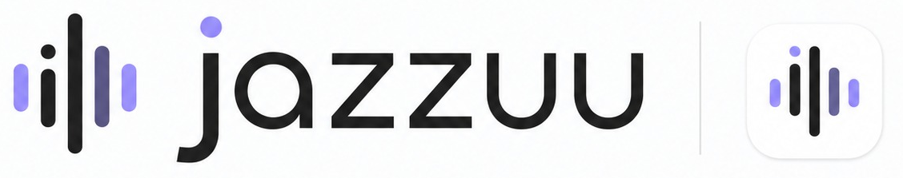

# Jazzuu



**A private multilingual recording archive.**

`жазуу` — *writing, a record* in Kyrgyz.

Voice recorders give you audio. Jazzuu turns recordings into
something you can actually search a year later: transcribed, summarised,
labelled, and readable on a phone.

Built for multilingual and code-switched speech. Kyrgyz, Russian and English
are useful examples, not a fixed language list: deployments can install a
compatible specialist model for another language in Tilmech without changing
Jazzuu.

## What it does

- **Ingests** audio from a hardware recorder, a watched folder, or an upload.
- **Transcribes** it via [Tilmech](https://github.com/niyazirsaliev/tilmech),
  which routes a deployment-selected specialist language and multilingual
  speech between two engines.
- **Summarises** each recording into a title, a summary, action items and a
  mind map, in the reader's language.
- **Labels** recordings automatically — work, personal, idea — and lets you
  correct any label by hand.
- **Serves** a mobile-first reader: search-first, twenty recordings per page,
  one global RU/EN switch that changes the current interface and summary
  presentation. This switch does not limit transcription languages.
- **Shares** a single recording via an opaque, expiring link when you choose
  to.

## Multi-tenant by design

Each person or team is a tenant with its own archive, database and
their own bearer token. A tenant's audio root is derived from its
authenticated identity, so no request can reach another tenant's recordings.
There is no shared pool and no admin view over everyone's speech.

## Components

| directory | what it is |
|---|---|
| `viewer/` | the reader: FastAPI + a dependency-free PWA front end |
| `archive/` | ingest, ASR jobs, summarisation, retention |
| `recordings_mcp/` | [MCP](https://modelcontextprotocol.io/) access for AI agents |
| `semantic_search/` | embedding search over transcripts |
| `deploy/` | compose files and connector samples |

### recordings-mcp

An authenticated, read-only MCP server (`MCP записей`) that lets an AI assistant read the
archive without touching audio files. Recordings are addressed by their stable
`N-0123` number rather than an internal id, so a human and an agent can refer
to the same recording out loud.

| tool | returns |
|---|---|
| `recordings_list` | one bounded page of recordings, newest first |
| `recordings_search` | full-text search over names and transcripts |
| `recording_get` | metadata, transcript and summary for one recording |
| `recording_mindmap_get` | the structured mind map for one recording |

Every call is bearer-authenticated and scoped to a single tenant. The tools are
read-only: nothing an agent does can alter or delete a recording.

## Requirements

- Docker and Docker Compose
- A [Tilmech](https://github.com/niyazirsaliev/tilmech) instance for transcription
- An OpenAI-compatible endpoint for summarisation — a local model works
- Optional: Tailscale, if you want the reader reachable only inside your own network

## Use any specialist language

Jazzuu does not bundle or hardcode an ASR language model. It sends tenant-
authorized audio to the configured Tilmech endpoint and stores the returned
language code as metadata, including mixed values such as `fr+ar` or `ja+en`.
The reader renders unfamiliar ISO language codes generically instead of
rejecting them.

Choose the specialist profile in the Tilmech deployment:

```env
ASR_SPECIALIST_MODEL=your-org/your-language-model
ASR_SPECIALIST_REVISION=0123456789abcdef0123456789abcdef01234567
ASR_SPECIALIST_LANGUAGE=fr
ASR_SPECIALIST_MARKERS=éèêëàâçîïôùûüÿœ
ASR_GENERAL_CONFIDENT_LANGUAGES=en,de,es
```

The model must be compatible with Tilmech's specialist pipeline, and its
revision must be an immutable commit SHA. Keep the specialist language out of
`ASR_GENERAL_CONFIDENT_LANGUAGES` so the general route cannot bypass it. See
[Tilmech's configuration documentation](https://github.com/niyazirsaliev/tilmech)
for the complete contract.

## Quick start

Copy the non-secret examples, create tenant-private runtime paths, then set the
PLAUD/ASR endpoints, the exact presigned-audio host allow-list, and host paths
in `archive/connector.env`:

```bash
cp archive/connector.env.example archive/connector.env
cp viewer/.env.example viewer/.env
cp recordings_mcp/recordings-mcp.env.example recordings_mcp/recordings-mcp.env
install -d -m 700 /tmp/jazzuu/{archive,creds,control,public-shares,mcp-state,gateway,models/diarization}
python3 -c 'import secrets; open("/tmp/jazzuu/recordings-control-token","w").write(secrets.token_urlsafe(32))'
chmod 600 /tmp/jazzuu/recordings-control-token
python3 -c 'import secrets; open("/tmp/jazzuu/public-share-secret","w").write(secrets.token_urlsafe(32))'
chmod 600 /tmp/jazzuu/public-share-secret
python3 -c 'import pathlib,secrets; p=pathlib.Path("viewer/.env"); p.write_text(p.read_text().replace("replace-with-a-random-secret", secrets.token_urlsafe(32)))'
# Put the PLAUD/ASR caller-token files in /tmp/jazzuu/creds and set endpoints.
sudo chown -R 10000:10000 /tmp/jazzuu
docker compose --env-file archive/connector.env -f archive/docker-compose.yml up -d --build
docker compose --env-file viewer/.env -f viewer/docker-compose.yml up -d --build
docker compose --env-file recordings_mcp/recordings-mcp.env -f recordings_mcp/docker-compose.yml up -d --build
VIEWER_IMAGE=jazzuu-viewer:latest PUBLIC_SHARE_BASE_URL=https://share.example.com PUBLIC_SHARE_STORE=/tmp/jazzuu/public-shares PUBLIC_SHARE_GATEWAY_STATE=/tmp/jazzuu/gateway PUBLIC_SHARE_SECRET_FILE=/tmp/jazzuu/public-share-secret docker compose -f deploy/public-share/docker-compose.yml up -d
python3 viewer/gen_magic_link.py http://localhost:8000
```

The reader binds to `127.0.0.1:8000` by default. The explicit localhost HTTP
URL above is development-only. For access from another device, keep secure
cookies enabled and put the viewer behind HTTPS (or an HTTPS tunnel); never
bind the plain-HTTP viewer directly to a remote interface. Public one-record
sharing is a separate deployment described in
[`deploy/public-share/README.md`](deploy/public-share/README.md).

## Privacy stance

This is the whole point of the project, so it is worth being explicit:

- Recordings, transcripts and summaries stay on your hardware when every
  configured PLAUD, ASR and OpenAI-compatible endpoint is self-hosted.
- A remote PLAUD endpoint receives recorder API requests and supplies audio;
  a remote ASR endpoint receives audio; a remote summarisation endpoint receives
  transcript text. Review those operators' privacy terms before configuring them.
- The reader is not published to the internet by default.
- Public share links are opaque, expiring, and created one recording at a time.
- Transcript text sent to a language model is fenced as untrusted data — speech
  in a recording cannot issue instructions to the summariser.
- Speaker voiceprints are learned only from explicitly confirmed assignments,
  never from guesses.

## Tests

```bash
pip install --require-hashes -r viewer/requirements.lock
pip install pytest==8.4.2 httpx==0.28.1 jinja2==3.1.6 python-multipart==0.0.21 itsdangerous==2.2.0
pytest tests/ viewer/tests/ -q
cd viewer && node --test tests/*.test.js
```

820 Python tests and 104 JavaScript tests, no network required.

## Status

Public beta. The deployment model favors a small number of explicitly isolated
tenants and self-hosted infrastructure over a shared multi-customer control
plane.

The transcription engine is a separate project —
[Tilmech](https://github.com/niyazirsaliev/tilmech) — because the mixed-language
routing is useful on its own.

## License

MIT. See [LICENSE](LICENSE). Bundled DejaVu fonts retain their third-party
license in [`viewer/app/fonts/LICENSE-DejaVu.txt`](viewer/app/fonts/LICENSE-DejaVu.txt).
Model, asset, container-base, and direct dependency provenance is recorded in
[THIRD_PARTY_NOTICES.md](THIRD_PARTY_NOTICES.md).
